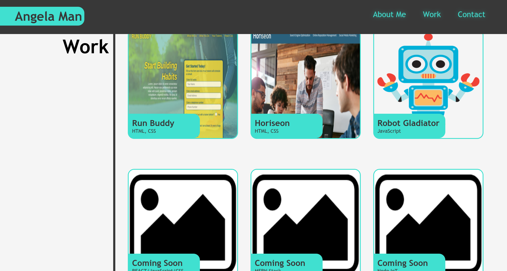
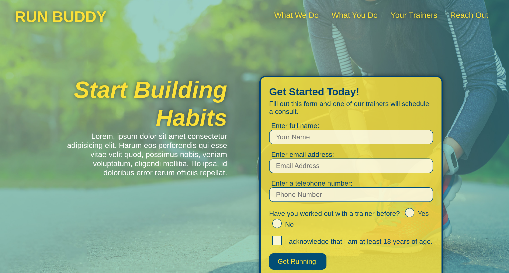
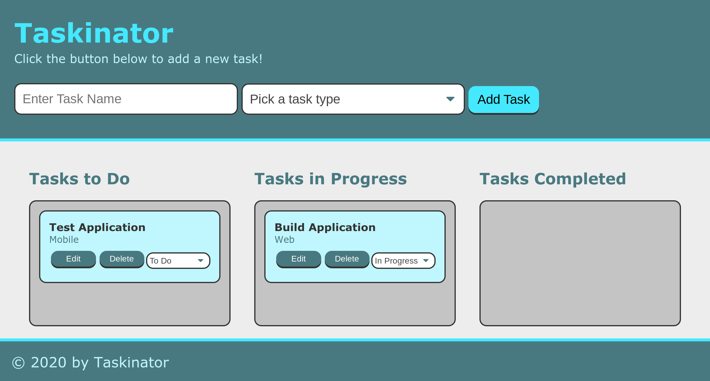
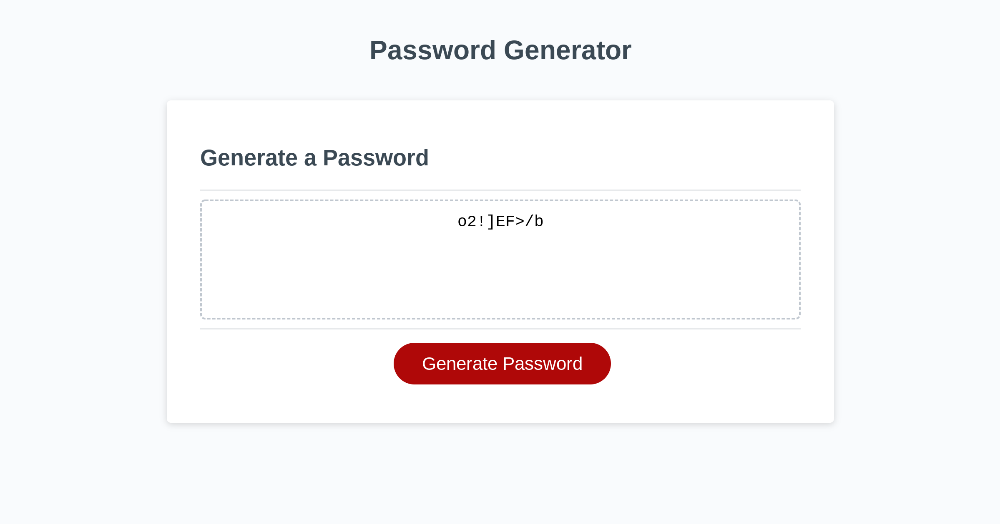

# Portfolio

## Purpose
A website that showcases my projects and abilities as a web developer

## Built With
* HTML
* CSS

## Website
https://akman47.github.io/portfolio

## Snapshot

## Applications
* Run Buddy (https://akman47.github.io/run-buddy)

* Taskinator (https://akman47.github.io/taskinator)

* Password Generator (https://akman47.github.io/password-generator)

## Criteria
* GIVEN I need to sample a potential employee's previous work
* WHEN I load their portfolio
* THEN I am presented with the developer's name, a recent photo, and links to sections about them, their work, and how to contact them
* WHEN I click one of the links in the navigation
* THEN the UI scrolls to the corresponding section
* WHEN I click on the link to the section about their work
* THEN the UI scrolls to a section with titled images of the developer's applications
* WHEN I am presented with the developer's first application
* THEN that application's image should be larger in size than the others
* WHEN I click on the images of the applications
* THEN I am taken to that deployed application
* WHEN I resize the page or view the site on various screens and devices
* THEN I am presented with a responsive layout that adapts to my viewport

## Contribution
Made by Angela Man