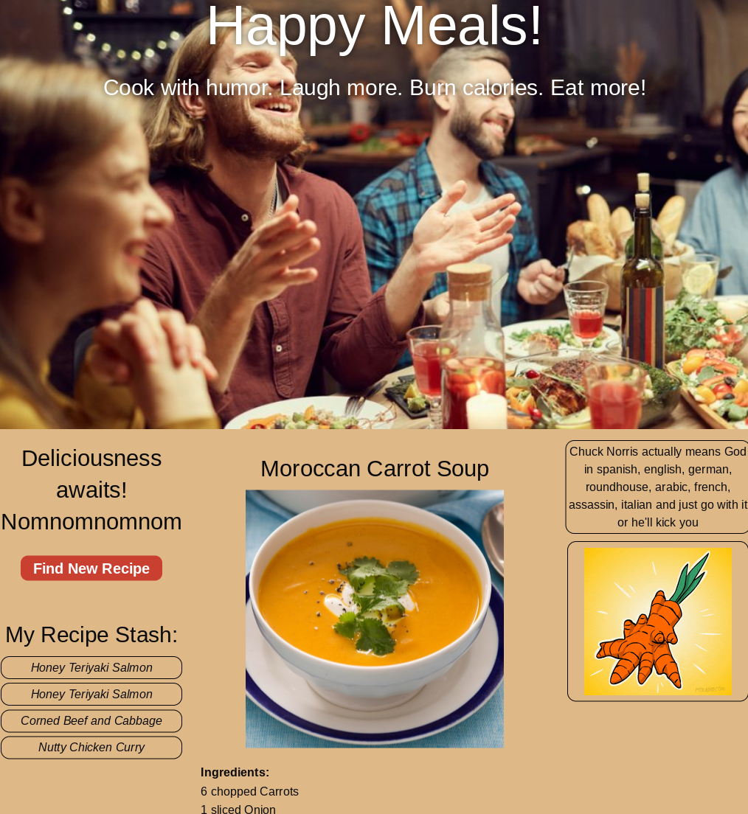

# Portfolio

## Description
A website that showcases my projects and abilities as a web developer

## Built With
* HTML
* CSS

## Website
https://akman47.github.io/portfolio

## Snapshot

## Applications
* [Clonello](https://powerful-falls-76508.herokuapp.com/)

* [Tech Blog](https://protected-oasis-13537.herokuapp.com/)

* Run Buddy (https://akman47.github.io/run-buddy)

* Weather Dashboard (https://akman47.github.io/weather-dashboard)

* Coding Quiz (https://akman47.github.io/code-quiz)

* Taskmaster-Pro (https://akman47.github.io/taskmaster-pro)

* Password Generator (https://akman47.github.io/password-generator)

* [Happy Meals](https://jmol721.github.io/get-you-a-happy-meal-toy-not-included)

## Credit
Angela Man
[GitHub](https://github.com/akman47)